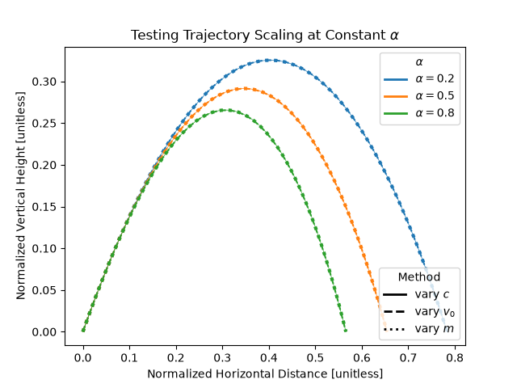
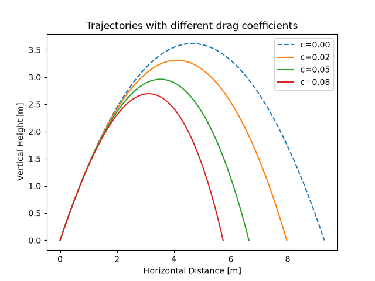
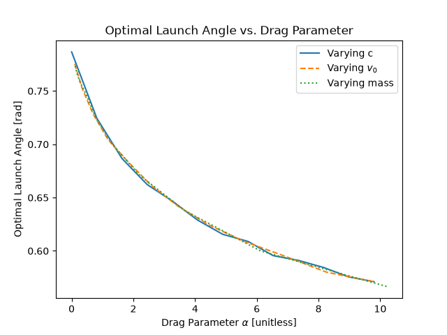

# Scaling Laws in Projectile Motion with Quadratic Drag

A computational physics project investigating projectile motion through numerical simulation. The project begins with ideal projectile motion, where an analytical solution provides a way to validate Euler's Method, and then extends the model to include quadratic air resistance.

The drag model is used to investigate how aerodynamic resistance affects projectile trajectories, optimal launch angle, and the scaling of the system. In particular, the project explores whether the behavior of projectiles with different physical parameters can be described by a single dimensionless quantity.



**Figure 5.** Normalized trajectories for three values of $\alpha$, with each
value generated through three independent parameterizations of $c$, $v_0$,
and $m$. The close overlap demonstrates numerical agreement with the scaling
predicted by $\alpha=cv_0^2/(mg)$.

## Motivation

Projectile motion provides a useful system for exploring computational physics because its equations of motion can be solved numerically while the ideal case also has a known analytical solution.

The project begins with ideal projectile motion to establish the accuracy and limitations of the numerical method. Quadratic air resistance is then introduced, producing a nonlinear system without a simple closed-form solution.

Rather than treating the drag coefficient as the only parameter controlling the system, the drag model is analyzed using dimensional analysis. This leads to the dimensionless parameter

$$
\alpha = \frac{cv_0^2}{mg},
$$

which represents the characteristic magnitude of the initial drag force relative to the projectile's weight.

The main goal is to investigate whether $\alpha$ captures the relevant behavior of the system independently of the individual values of $c$, $v_0$, and $m$.

## Mathematical Model

The projectile is represented by the state vector:

$$
\mathbf{s} =
\begin{bmatrix}
x \\
y \\
v_x \\
v_y
\end{bmatrix}
$$

The second-order equations of motion are rewritten as a coupled system of first-order differential equations so they can be integrated numerically using Euler's Method.

### Ideal Projectile Motion

For ideal projectile motion:

$$
\frac{dx}{dt}=v_x
$$

$$
\frac{dy}{dt}=v_y
$$

$$
\frac{dv_x}{dt}=0
$$

$$
\frac{dv_y}{dt}=-g
$$

### Quadratic Air Resistance

The drag force is modeled as

$$
\mathbf{F}_d=-\frac{1}{2}C_d\rho A|\mathbf{v}|\mathbf{v}
$$

where $C_d$ is the drag coefficient, $\rho$ is air density, and $A$ is cross-sectional area.

These quantities are combined into the quadratic drag parameter

$$
c=\frac{1}{2}C_d\rho A.
$$

The resulting accelerations are

$$
a_x=-\frac{c}{m}|\mathbf{v}|v_x
$$

$$
a_y=-g-\frac{c}{m}|\mathbf{v}|v_y.
$$

Unlike the ideal projectile model, the acceleration now depends on the instantaneous velocity, making the system nonlinear.

## Numerical Method

The equations of motion are solved using Euler's Method:

$$ 
\mathbf{s}_{n+1} =
\mathbf{s}_n
+
\Delta t
\frac{d\mathbf{s}}{dt}.
$$

Because Euler's Method evaluates the derivative only at the beginning of each timestep, it approximates the solution using a local linear approximation. The local truncation error is $O(\Delta t^2)$, while the accumulated global error is $O(\Delta t)$.

The ideal projectile model provides an analytical reference against which this numerical error can be measured.

To improve the accuracy of the estimated range, the impact location is determined by linearly interpolating between the final point above the ground and the first point below it.

## Results

### 1. Numerical Convergence

The ideal projectile model was simulated using several different timestep sizes. As the timestep was reduced, the numerical trajectories converged toward the analytical solution.

This provides a visual demonstration of how the resolution of Euler's Method affects the numerical solution.


**Figure 1.** Ideal projectile trajectories calculated using different timestep sizes. As the timestep decreases, the numerical solution approaches the analytical trajectory.

### 2. Numerical Error

The numerical error was then quantified by comparing the simulated range with the analytical range for different timestep sizes.

The range error decreases approximately linearly with timestep size, consistent with the first-order global accuracy expected from Euler's Method.


**Figure 2.** Range error as a function of timestep size for ideal projectile motion. The approximately linear relationship demonstrates the first-order convergence of Euler's Method.

### 3. Effect of Quadratic Drag

After validating the numerical method using the ideal model, quadratic air resistance was introduced.

The quadratic drag parameter $c$ was varied while keeping the other physical parameters fixed. Increasing $c$ increases the strength of aerodynamic resistance, producing shorter-range trajectories and changing the shape of the projectile's path.



**Figure 3.** Projectile trajectories for several values of the quadratic drag parameter $c$, with the remaining physical parameters held constant.

### 4. Optimal Launch Angle and Parameter Scaling

The launch angle producing the maximum horizontal range was determined computationally for different values of the quadratic drag parameter.

A coarse-to-fine search was used to efficiently locate the optimal angle. The results show that the optimal launch angle changes systematically as the strength of drag changes.

To determine whether this behavior depends specifically on $c$, or instead on a combination of the physical parameters, the dimensionless quantity

$$
\alpha=\frac{cv_0^2}{mg}
$$

was introduced.

This quantity represents the characteristic initial drag force relative to the projectile's weight. The optimal-angle calculation was repeated while varying $c$, $v_0$, and $m$ independently, while keeping $\alpha$ fixed.

The resulting curves overlap closely, suggesting that the optimal launch angle is governed by $\alpha$ rather than by any one of its constituent parameters.



**Figure 4.** Optimal launch angle as a function of drag strength, showing the overlap obtained from different parameterizations that produce the same dimensionless parameter $\alpha$.

### 5. Trajectory Scaling Test

The final experiment tests whether the scaling described by $\alpha$ applies to the entire trajectory, rather than only to the optimal launch angle.

For each of

$$
\alpha=0.2,\quad 0.5,\quad 0.8,
$$

three physically different parameterizations were constructed:

* varying $c$ while fixing $v_0$ and $m$,
* varying $v_0$ while fixing $c$ and $m$,
* varying $m$ while fixing $c$ and $v_0$.

In each case, the parameters were chosen so that the resulting systems had the same value of $\alpha$.

The trajectories were then nondimensionalized and compared.


**Figure 5.** Normalized trajectories for three values of $\alpha$, with each value generated through three independent parameterizations of $c$, $v_0$, and $m$. The close overlap demonstrates numerical agreement with the scaling predicted by $\alpha=cv_0^2/(mg)$.

The three parameterizations closely overlap for each value of $\alpha$. This supports the prediction that, after nondimensionalization, the trajectory depends on the combined parameter $\alpha$ rather than independently on $c$, $v_0$, and $m$.

## Key Findings

* Euler's Method converges toward the analytical solution for ideal projectile motion with first-order global accuracy.
* Quadratic air resistance reduces range and maximum height and changes the shape of the trajectory.
* The optimal launch angle is not fixed at $45^\circ$ when quadratic drag is present.
* The dimensionless quantity

$$
\alpha=\frac{cv_0^2}{mg}
$$

provides a natural measure of drag strength relative to gravity.

* Different combinations of $c$, $v_0$, and $m$ that produce the same $\alpha$ generate closely overlapping normalized trajectories.
* The computational results therefore support the idea that $\alpha$ is the relevant dimensionless parameter governing the scaled drag problem.

## Project Structure

```text
Projectile_Motion/
├── main.py           Runs simulations and generates plots
├── physics.py        Defines the equations of motion
├── solvers.py        Implements numerical integration methods
├── analysis.py       Performs interpolation, optimization, and analysis
├── requirements.txt  Lists project dependencies
└── README.md         Project documentation
```

## Requirements

* Python 3
* NumPy
* Matplotlib

## Running the Project

### 1. Clone the repository

```bash
git clone https://github.com/rohitkb7782/Projectile_Motion.git
cd Projectile_Motion
```

### 2. Install the dependencies

```bash
pip install -r requirements.txt
```

### 3. Select the Projectile Model

Open `main.py` and select the desired model using the `model` variable.

For ideal projectile motion:

```python
model = "ideal"
```

For projectile motion with quadratic drag:

```python
model = "drag"
```

### 4. Run the simulation

```bash
python main.py
```

The program generates trajectory plots and performs the corresponding numerical analysis.

## Future Improvements

* Implement higher-order integration methods such as Runge-Kutta (RK4)
* Compare the convergence and computational cost of different numerical integration methods
* Add wind forces
* Investigate non-uniform air density
* Model gravity variation with altitude
* Explore analytical or semi-analytical approximations for the quadratic-drag system

## Conclusion

This project began as a numerical simulation of projectile motion and developed into an investigation of the structure of a nonlinear physical system.

The ideal projectile model provided a controlled environment for validating Euler's Method. Quadratic air resistance was then introduced and used to study how drag changes projectile trajectories and the optimal launch angle.

Dimensional analysis revealed the parameter

$$
\alpha=\frac{cv_0^2}{mg},
$$

which combines the relevant physical quantities into a single dimensionless measure of drag strength. Computational experiments then tested this prediction by constructing physically different systems with identical values of $\alpha$.

The resulting collapse of the normalized trajectories provides numerical evidence that the dimensionless parameter captures the underlying scaling of the system.

This progression—from numerical validation, to physical investigation, to dimensional analysis, and finally to computational testing—forms the central structure of the project.
